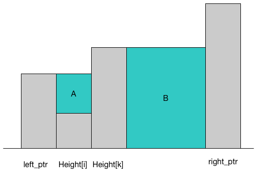

## Solution explanation

### Solution 1: Brute Force

The basic idea for trapping a water is very simple: for a given `height[i]` (i.e., the 1 unit long
column), the water it can trap determined by the minimum value of the two maximum values:
the maximum height to the left of `height[i]` and the maximum height to the right of `height[i]`.
Let's say those two maximum values are `height[l]` with `l <= i` and `height[r]` with `r >= i`.
Then, the amount of water we can trap for `height[i]` is calculated as
`min(height[l],height[r]) - height[i]`. We calculate the water can trap for every possible `height[i]`
to get our final answer.

### Solution 2: DP

DP approach is a direct optimization of the brute force approach above. Instead of repeatedly
search for the `height[l]` and `height[r]` for a given `i`, we build two DP tables `left_max`
and `right_max`:

- left_max[i] = the maximum height between [0,i]
- right_max[i] = the maximum height between [i, height.size()-1]

Then we solve the problem like brute force but now instead of repeatedly looking for `height[l]`
and `height[r]`, we simply look up in our DP tables.

### Solution 3: Two pointers

Two pointer approach still uses the idea from brute force approach, where for a water trap at `i`, we
calculate `min(height[l],height[r]) - height[i]`. However, we do the calculation implicitly.
To understand the idea, let's take a look at the image below:

Both `left_ptr` and `right_ptr` start at the position shown in the image. The invariant we have here
is at any time point, the `left_ptr` always point to the maximum value between `[0, left_ptr]`
and the `right_ptr` always point to the maximum value between `[right_ptr, height.size()-1]` before
`minHeight = min(left_ptr, right_ptr);` get executed. Once the `minHeight` is updated and we're in
the next iteration of the outer `while` loop, any code get executed inside the two inner `while` loop
will have the guarantee that `min(height[l],height[r]) - height[i]` holds (i.e., `minHeight - height[left_ptr]`
or `minHeight - height[right_ptr]`. Thus, we essentially perform the same thing as brute force approach.

## Reference

- https://leetcode.com/problems/trapping-rain-water/solution/
- https://leetcode.com/problems/trapping-rain-water/discuss/17403/8-lines-CC++JavaPython-Solution